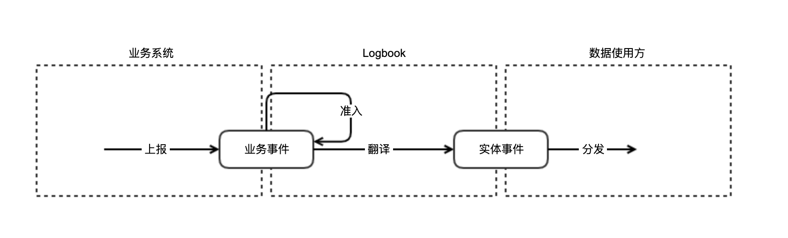

# logbook 简介
logbook 是一款面向 ToB 业务的服务端埋点方案




# 概念介绍

#### 1. 业务系统
支撑业务正常运转的软件系统体系，统称为业务系统。

#### 2. 业务事件
单个业务系统中发生的事件，叫业务事件。 
业务事件可能影响到0个或多个实体。

#### 3. 上报
业务系统把自己感知到的业务事件提交给 logbook 的过程。

#### 4. 准入
logbook 接收业务系统的业务事件，业务事件的格式和内容由业务系统和logbook双方共同约定。
在 logbook 接收事件时、会对约定格式/内容做校验，校验的过程叫做准入。

#### 5. 实体事件
单一实体视角发生的事件，叫实体事件。 
实体事件只涉及到单个实体，由业务事件加工后得到。

#### 6. 翻译
logbook 把业务事件翻译成实体事件的过程。

#### 7. 数据使用方
需要使用实体事件作为输入，来支撑自身业务的系统。

#### 8. 分发
logbook 把实体事件处理后发送给对应的数据使用方的过程。

---


# logbook 核心能力
1. 定义了 业务事件-实体事件 的数据输出和转发规范
2. 提供了 业务事件准入、翻译，实体事件过滤、分发的基础能力


# 实施标准

### 1. 业务事件
标准格式：
- biz_event_type，Integer业务事件类型
- biz_event_id，Long，业务事件id、是业务事件的唯一标识
- biz_event_info，Json String，业务事件的上下文信息
- biz_entity_info_before，Json String，业务事件影响到的实体、在事件发生前的实体信息
- biz_entity_info_after，Json String，业务事件影响到的实体、在事件发生后的实体信息


### 2. 实体事件
标准格式：
- entity_type，Integer，实体类型
- entity_id	String，实体id
- entity_info_before_event，Json Object，实体在事件发生前的数据快照
- entity_info_after_event，Json Object，实体在事件发生后的数据快照
- event_type，Integer，事件类型
- event_id，String，事件id
- event_time，String，事件时间
- event_report_caller，String，事件上报方
- event_info，Json Object，实体事件相关的上下文信息

### 3. 准入
对业务事件的准入方案，目前支持 jsonSchema 校验，可扩展。

### 4. 翻译
将业务事件翻译为实体事件的方案，目前支持 groovy 翻译，可扩展。

### 5. 过滤
将实体事件分发给具体某个使用方前，可以进行简单的过滤，目前支持 groovy 过滤，可扩展。

### 6. 消息队列
业务事件翻译为实体事件后，会存入消息队列，目前支持 kafka 消息队列，暂不支持扩展。
实体事件也是通过 kafka 分发给数据使用方，暂不支持扩展。

---

# 快速开始

### 1. 阅读 api 接口
文档位置：```docs/ApiDocs.md``

### 2. 修改 yml配置
修改 application.yml 配置文件，路径：```logbook-server/src/main/resources/application.yml```
- 必须修改的是 spring.datasource 开头的数据库配置
- 其他配置可以使用默认值，也可以视情况进行调整

### 3. 修改数据库配置
logbook 内部需要用到 12 张表，其中：
- 配置侧需要 10 张表，建表语句路径：```logbook-server/sql/config.sql```
- 执行侧需要 2 张表，建表语句路径：```logbook-server/sql/run.sql```

### 4. 添加 mysql 驱动
- 可以通过 maven 引入
```
        <dependency>
            <groupId>mysql</groupId>
            <artifactId>mysql-connector-java</artifactId>
            <version>${mysql-connector.version}</version>
        </dependency>
```

### 5. 二次开发
logbook 没有提供默认的消息队列实现，需要使用方选型完成后进行二次开发。
- 二次开发需要完成的逻辑统一收敛在：`logbook/logbook-server/src/main/java/com/didiglobal/mq/MQCustomizedUtil.java`
- 代码注释里给出了 kafka-clients 2.8.1 的示例代码，如需使用需要在 pom 文件里添加相应的依赖：
```
        <dependency>
            <groupId>org.apache.kafka</groupId>
            <artifactId>kafka-clients</artifactId>
            <version>${kafka-client.version}</version>
        </dependency>
```

### 6. demo
- 部署好 kafka 环境
- 创建好 demo 中用到的 4个 topic：inner_worksheet_events、inner_user_events、destinate_downstream1、destinate_downstream2
- 修改 ```docs/logbookDemoSql.sql``` 中的 "你的kafka地址" 为真实的 kafka 地址
- 执行修改后的 ```docs/logbookDemoSql.sql``` 将 demo 的配置侧数据写入到数据库
- 执行 ```docs/ApiDemo.md``` 中的请求，进行 demo 测试