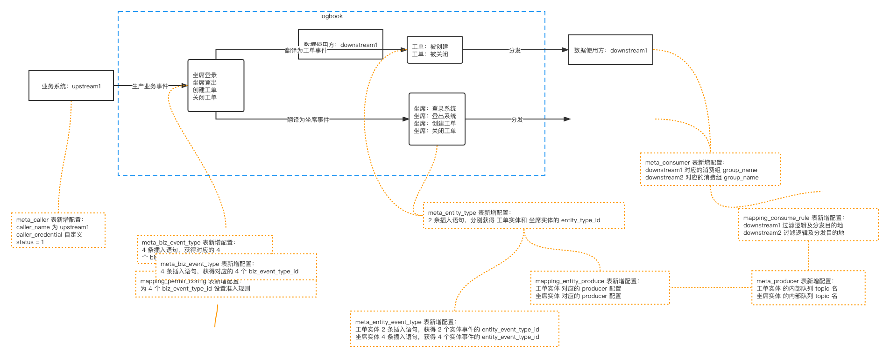

## 1. demo 模型


## 2. demo 配置
demo表初始化数据：```docs/logbookDemoSql.sql```
> 注意需要将"你的kafka地址"替换为真实的 kafka 地址

## 3. demo 执行

### 3.1 "创建工单"业务事件准入

发起请求：

```shell
curl --location --request POST 'http://localhost:8102/logbook/api/event/permit' \
--header 'Content-Type: application/json' \
--header 'x-caller: upstream1' \
--header 'x-authorization: 65743a9c0e17c01e31c808757164177b' \
--data-raw '{
    "biz_event_type":20000,
    "biz_event_id":"20000_000001",
    "biz_event_info":{
        "event_time":1595146912656,
        "user_id":0
    },
    "biz_entity_info":{
        "worksheet_info":{
            "worksheet_id":1536426382,
            "area":"背景",
            "content":"测试用户进线反馈订单支付失败问题",
            "create_time":"2020-06-10 15:36:55",
            "question":"订单支付失败",
            "user_id":220020
        },
        "user_info":{
            "user_id":220020
        }
    },
    "biz_entity_info_before":{
        "worksheet_info":{
        },
        "user_info":{
            "user_id":220020
        }
    }
}'
```

返回结果：
```json
{
    "errno": 0,
    "errmsg": "成功",
    "data": {
        "success": true,
        "msg": {
            "logLevel": "INFO",
            "exception_threshold": "FATAL",
            "is_success": true,
            "validate_result": []
        }
    }
}
```

### 3.2 "创建工单"业务事件翻译
发起请求：
```shell
curl --location --request POST 'http://localhost:8102/logbook/api/event/translate' \
--header 'Content-Type: application/json' \
--header 'x-caller: upstream1' \
--header 'x-authorization: 65743a9c0e17c01e31c808757164177b' \
--data-raw '{
    "biz_event_type":20000,
    "biz_event_id":"20000_000001",
    "biz_event_info":{
        "event_time":1595146912656,
        "user_id":0
    },
    "biz_entity_info":{
        "worksheet_info":{
            "worksheet_id":1536426382,
            "area":"背景",
            "content":"测试用户进线反馈订单支付失败问题",
            "create_time":"2020-06-10 15:36:55",
            "question":"订单支付失败",
            "user_id":220020
        },
        "user_info":{
            "user_id":220020
        }
    },
    "biz_entity_info_before":{
        "worksheet_info":{
        },
        "user_info":{
            "user_id":220020
        }
    }
}'
```

返回结果：
```json
{
    "errno": 0,
    "errmsg": "成功",
    "data": {
        "all_success": true,
        "translate_and_sync_results": [
            {
                "final_success": true,
                "translate_success": true,
                "translate_success_result": {
                    "trace_id": "5dd05f93c10946b1943a70e362758ff7",
                    "span_id": "7c3846ab4ea740dd83b816b5b5b48fd0",
                    "entity_type": 30000,
                    "entity_id": "1536426382",
                    "entity_info_before_event": {},
                    "entity_info_after_event": {
                        "area": "背景",
                        "create_time": "2020-06-10 15:36:55",
                        "question": "订单支付失败",
                        "user_id": 220020,
                        "worksheet_id": 1536426382,
                        "content": "测试用户进线反馈订单支付失败问题"
                    },
                    "event_type": 40000,
                    "event_id": "upstream1.20000_000001.1",
                    "event_time": 1595146912656,
                    "event_report_system": "upstream1",
                    "event_info": {
                        "user_id": 0,
                        "event_time": 1595146912656
                    }
                },
                "produce_success": true,
                "produce_success_result": {
                    "success": true,
                    "result": {}
                }
            },
            {
                "final_success": true,
                "translate_success": true,
                "translate_success_result": {
                    "trace_id": "5dd05f93c10946b1943a70e362758ff7",
                    "span_id": "7c3846ab4ea740dd83b816b5b5b48fd0",
                    "entity_type": 30001,
                    "entity_id": "null",
                    "entity_info_before_event": {
                        "user_id": 220020
                    },
                    "entity_info_after_event": {
                        "user_id": 220020
                    },
                    "event_type": 40002,
                    "event_id": "upstream1.20000_000001.3",
                    "event_time": 1595146912656,
                    "event_report_system": "upstream1",
                    "event_info": {
                        "user_id": 0,
                        "event_time": 1595146912656
                    }
                },
                "produce_success": true,
                "produce_success_result": {
                    "success": true,
                    "result": {}
                }
            }
        ]
    }
}
```

### 3.3 若翻译失败，可重试

发起请求：
```shell
curl --location --request POST 'http://localhost:8102/logbook//api/retry/report' \
--header 'Content-Type: application/json' \
--header 'x-caller: upstream1' \
--header 'x-authorization: 65743a9c0e17c01e31c808757164177b' \
--data-raw '{
    "global_biz_event_id":"upstream1.20000_000001"
}'
```

返回结果：
```json
{
    "errno": 1,
    "errmsg": "已成功"
}
```


### 3.4 若翻译失败，可作废
发起请求：
```shell
curl --location --request POST 'http://localhost:8102/logbook/api/abort/biz_event_progress' \
--header 'Content-Type: application/json' \
--header 'x-caller: upstream1' \
--header 'x-authorization: 65743a9c0e17c01e31c808757164177b' \
--data-raw '{
    "global_biz_event_id":"upstream1.20000_000001"
}'
```

返回结果：
```json
{
    "errno": 100023,
    "errmsg": "业务事件记录已成功"
}
```

### 其他接口略